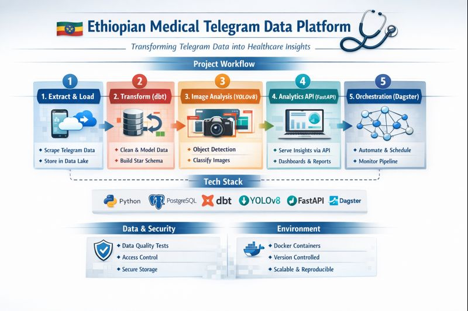

# Ethiopian Medical Telegram Data Platform 🚀


## 📌 Project Overview

This project delivers a comprehensive end-to-end ELT data platform designed to unlock actionable insights from Ethiopian medical businesses by harnessing publicly available data from Telegram channels. It seamlessly transforms raw Telegram messages and images into a clean, analytics-ready data warehouse, enriched with state-of-the-art image recognition powered by YOLOv8.

---

## 🏢 Business Goal

Empower stakeholders with data-driven insights including:

- 🔍 Most frequently mentioned medical products and brands

- 📊 Channel-level activity and posting trends over time

- 🖼️ Visual content classification to distinguish product displays, promotions, lifestyles, and more

- 📅 Daily and weekly message volume and engagement patterns

---
## 🛠️ Tech Stack

- Python: Telethon for Telegram scraping, Pandas for data wrangling

- PostgreSQL: Robust data warehousing solution

- dbt: Data transformation, testing, and documentation

- YOLOv8: Cutting-edge object detection for image enrichment

- FastAPI: High-performance REST API for analytical data access

- Docker: Containerized PostgreSQL and environment reproducibility

- Dagster: Pipeline orchestration and scheduling
  
---

## ✅ Pipeline Summary:
#### 1. Extract & Load

- Scrape Telegram messages and associated images across targeted medical channels

- Persist raw JSON data and images in a scalable data lake structure

#### 2. Transform (dbt)

- Standardize and clean data via staging models

- Construct a star schema data warehouse with dimensional tables (dim_channels, dim_dates) and fact tables (fct_messages)

- Enforce data quality through schema and custom business tests (e.g., no future-dated messages, non-negative views)

#### 3. Image Enrichment (YOLOv8)

- Detect and classify objects in images to enhance message data

- Categories include: promotional materials, product displays, lifestyle shots, and others

- Store enriched results in the fct_image_detections fact table for integrated analysis

---
#### 4. Analytical API (FastAPI)

- Serve cleaned and enriched data via a RESTful API

- Enable flexible querying for dashboarding, reporting, and advanced analytics
---
#### 5. Orchestration (Dagster)

- Automate the full ELT pipeline with task dependencies and retries

- Schedule daily runs to keep data fresh and insights up-to-date

- Monitor pipeline health and logs through Dagster’s UI
  
---
## 🔎 Data Quality Highlights

- Primary and foreign key constraints across tables

- Custom validation rules implemented as dbt tests

- Continuous integration of tests ensures reliability and trustworthiness

---
## 🚀 How to Run
bash 
```
# Run dbt transformations
dbt run

# Validate data quality
dbt test

# Generate and serve documentation
dbt docs generate
dbt docs serve

# Start the FastAPI analytics service
uvicorn src.api:app --reload

# Launch Dagster UI for pipeline orchestration
dagster dev -f scripts/pipeline.py

```
---
## 🎯 Impact

This platform empowers medical businesses and analysts with rich, timely insights — transforming raw Telegram chatter into strategic intelligence that drives smarter decision-making and market understanding across Ethiopia’s healthcare ecosystem.

